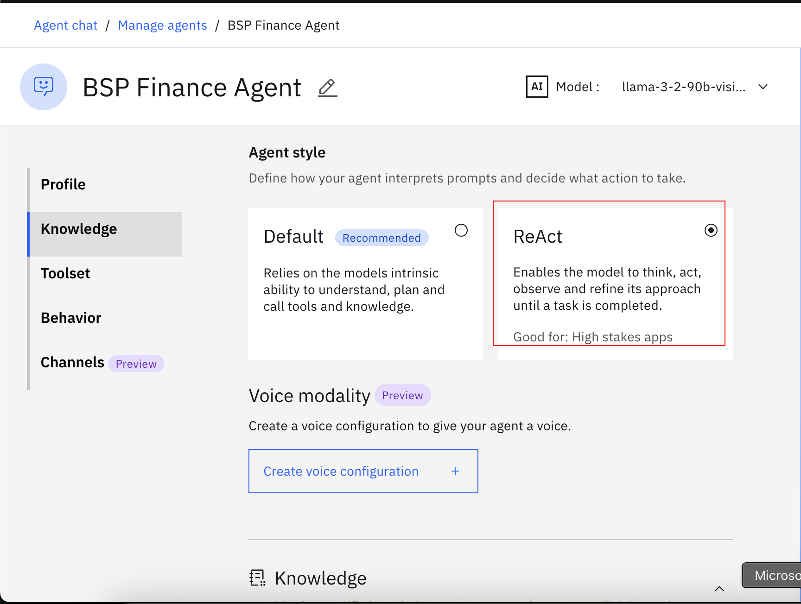
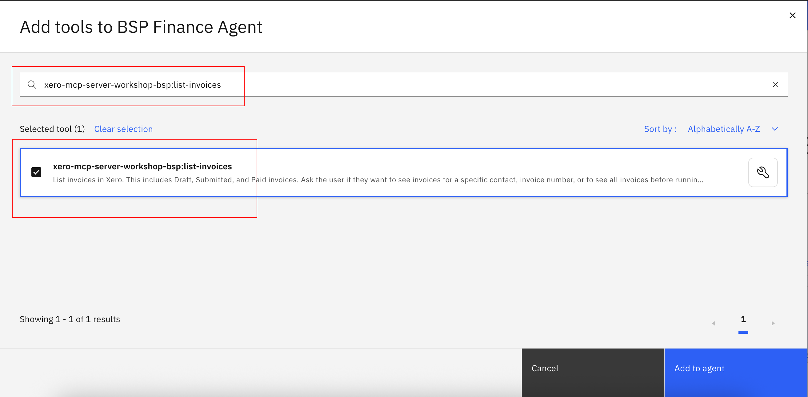
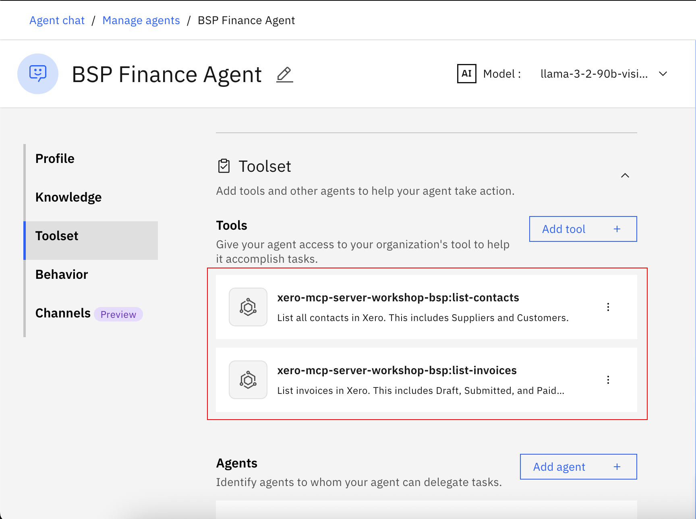

<!-- ---
layout: page
title: Finance Lab 1
# permalink: /lab1/
nav_order: 2
--- -->
# 🏦 Finance Agent: Automate finance oriented tasks with Agentic AI. (Lab 1: Building a multi tool agent)

## Use Case Description

This use case (in labs 1a, 1b) targets developing and deploying an Finance agent leveraging IBM watsonx Orchestrate. This agent will empower employees to interact with finance systems and access information efficiently through conversational AI.

In lab 1a, we will build a very simple Finance agent in watsonx Orchestrate, provide it with tools to list invoices and contacts.

## Step by step instructions to build the Finance Agent:

1. When you launch watsonx Orchestrate, you'll be directed to this page. Click on the hamburger menu in the top left corner:
   
2. Click on **Build**:
   
3. Click on **Create agent**:
   
4. Select "Create from scratch", give your agent a unique name (make sure to identify yourself by your initials or name, since this is a shared instance), e.g. "[Your Initial]\_Finance_Agent", and fill in the description as shown below:

```
This agent fetches procurement information for an organization. There are multiple tools for procurement information, such as account info, invoice info. There is also a knowledge resource on late payment policy.
```


5. Scroll to the Agent style and select **ReAct**.

6. Scroll to the **Toolset** section. Click on **Add tool**:

7. Click on the **Add from local instance**:

8. Search for "xero-mcp-server-workshop-bsp:list-invoices" and select the tool by checking the box:

9. Search for "xero-mcp-server-workshop-bsp:list-contacts" and select the tool by checking the box. Then click on **Add to agent**:

10. Wait until the tools has been added successfully and double check that it is now shown in the **Toolset** section:

11. Scroll down to the **Behavior** section. Insert the instructions below into the **Instructions** field:

```
when user asks invoices for a specific contact, get the contact id from list contacts before running list invoices tool one by one for each page.
when asked about pending invoices, iterate over all pages of list invoices tool and find the pending invoices from the whole list. Do not ask for user input. Provide all invoice information such as contact, amount paid or due and due date. Format the answer nicely.
Pending account receivables are those where Type is ACCREC and Status is AUTHORIZED.
```


12. Test your agent in the preview chat on the right side by asking the following questions and validating the responses. They should look similar to what is shown in the screenshot(s) below:

```
List 5 invoices.
```


```
which invoices are pending for Boom FM?
```


