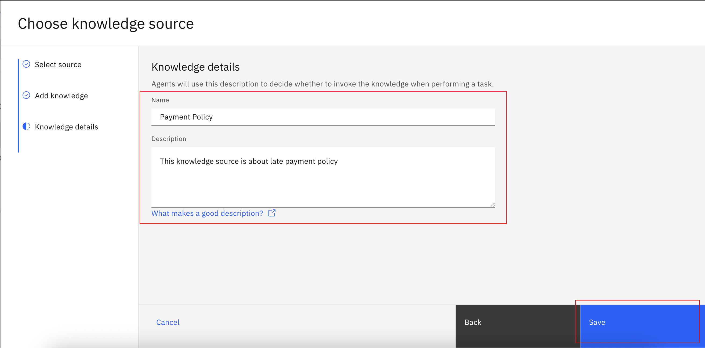
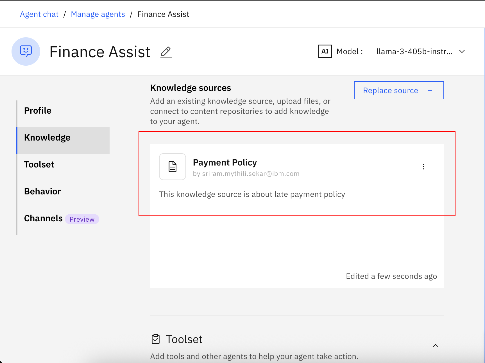
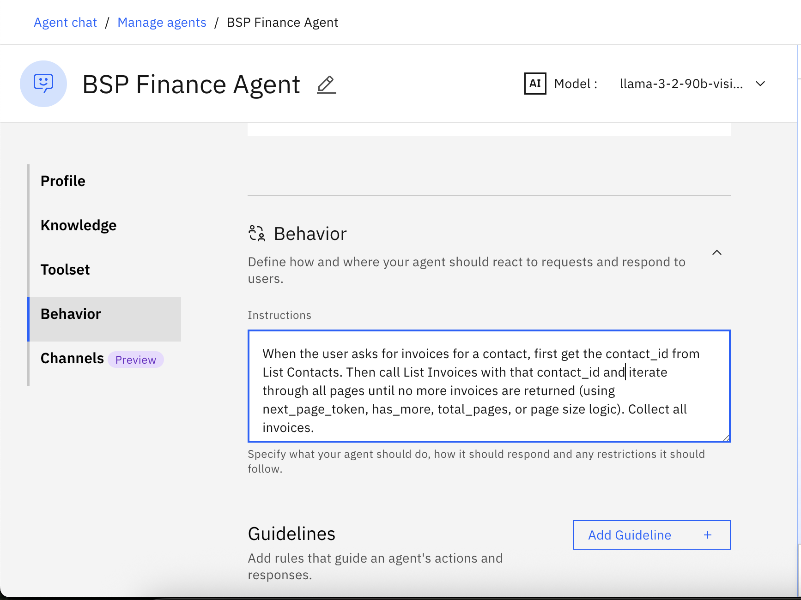

<!-- ---
layout: page
title: Finance Lab 2
# permalink: /lab2/
nav_order: 3
--- -->
# 🏦 Finance Agent: Automate finance oriented tasks with Agentic AI. (Lab 2: Adding Knowledge Base)

## Use Case Description

In lab 1b, we will add knowledge to our Finance agent in watsonx Orchestrate, and enable it to answer questions based on a knowledge base.

1. Scroll down the screen to the **Knowledge** section:


2. Click on **Upload files**. Then click on **Next**:


3. Drag and drop the <a href="../../pdfs/Late%20Payment%20Policy.pdf" target="_blank" rel="noopener">Late Payment Policy.pdf</a> and click on **Upload**:


4. Fill the description as shown below and click on **Save**:
```
This knowledge source is about late payment policy
```


5. Wait until the file has been uploaded successfully and double check that it is now shown in the **Knowledge** section:


6. Scroll to the **Behaviour** section and update the **Instructions** field:

```
When the user asks for invoices for a contact, first get the contact_id from List Contacts. Then call List Invoices with that contact_id and iterate through all pages until no more invoices are returned (using next_page_token, has_more, total_pages, or page size logic). Collect all invoices.

When the user asks for pending invoices, retrieve all invoices across all pages (with or without contact filter) and return only those with Type = ACCREC and Status = AUTHORIZED.

Do not ask the user for input. Always include contact name, invoice type, amount paid, amount due, due date, and status. Format the results in a clear table or list in markdown format.

Pending account receivables = Type ACCREC and Status AUTHORIZED.

Always check if theres any more pages remaining by calling the next page in the tools used.

When user asks about action for a company, look into the due date using the invoices tool. Based on the payment policy in the knowledge source and the due date, recommend the action to take.

The payment policy is in knowledge source. 
```



7. Test your agent in the preview chat on the right side by asking the following questions and validating the responses. They should look similar to what is shown in the screenshot(s) below:

```
for which invoices, accounts receivable are pending?
```


```
Based on the payment policy, what action should i take for City Limousines?
```


```
what about Bayside Club?
```

