# 🧾 Sales Agent: Automate sales oriented tasks with Agentic AI. (Lab 1: Building a multi tool agent)

## Use Case Description

This use case targets developing and deploying an Sales agent leveraging IBM watsonx Orchestrate. This agent will empower employees to interact with sales systems and access information efficiently through conversational AI.

In lab 1a, we will build a very simple Sales agent in watsonx Orchestrate, provide it with tools to list items, list contacts, list tax rates and create quote.

## Step by step instructions to build the Sales Agent:

1. When you launch watsonx Orchestrate, you'll be directed to this page. Click on the hamburger menu in the top left corner:
   
   


2. Click on  **Build**.:

   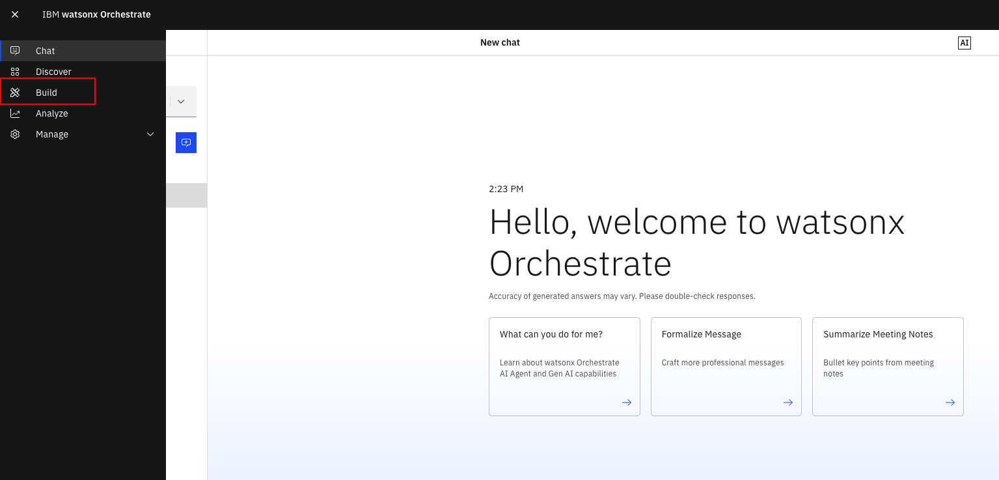


3. Click on **Create agent**:

   


4. Select "Create from scratch", give your agent a unique name (make sure to identify yourself by your initials or name, since this is a shared instance), e.g. "[Your Initial]\_Sales_Agent", and fill in the description as shown below:

```
This agent provides sales support for products. It also integrates with multiple tools like Xero to check prices, generate customer quotes with discounts, and review past quotes for specific clients. There is a also a knowledge resource on product catalog.
```


5. Click on the AI Model Tab and select Llama 3 405B Instruct (watsonx.ai).
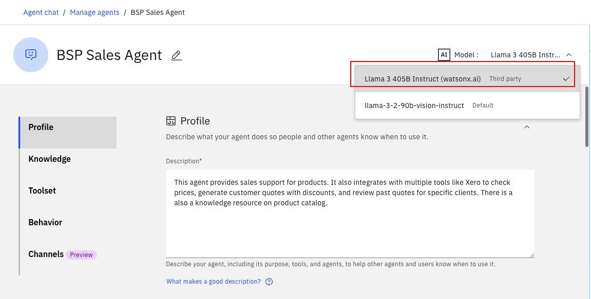


6. Scroll down the screen to the **Knowledge** section and click **Add source**:
   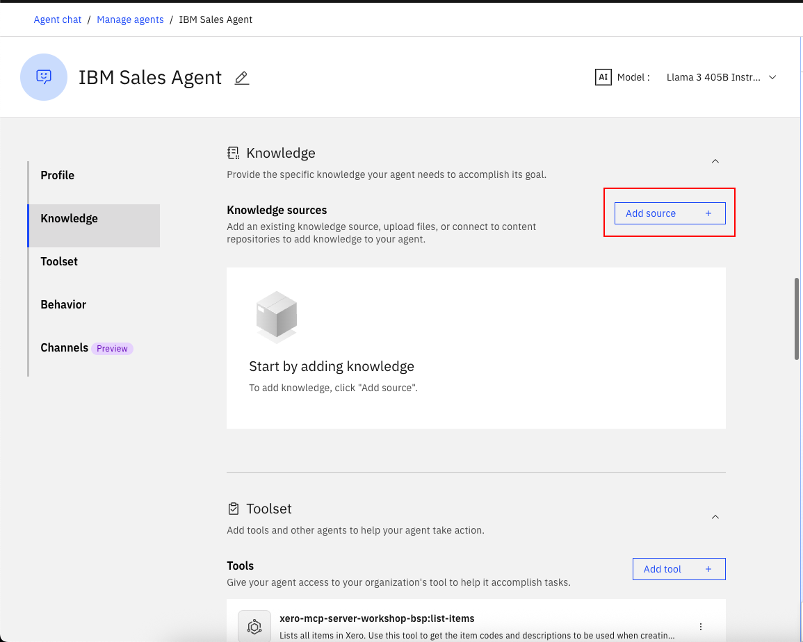


7. Click on **New knowledge**.
   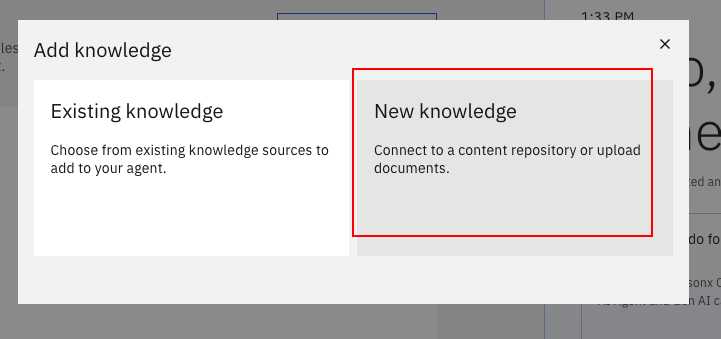


8. Click on **Upload files**, then **Next**:
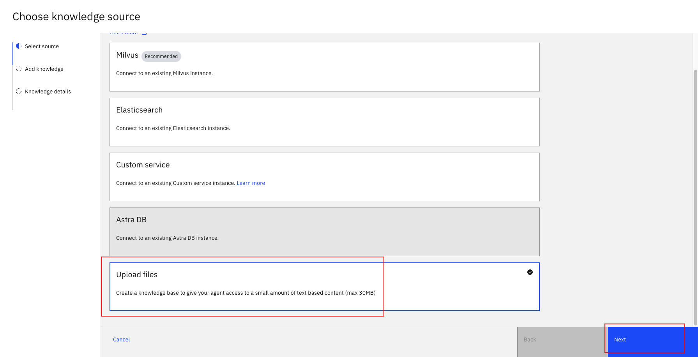


9. Drag and drop the <a href="../pdfs/Product%20Catalog.pdf" target="_blank" rel="noopener">Late Payment Policy.pdf</a> and click on **Next**:
   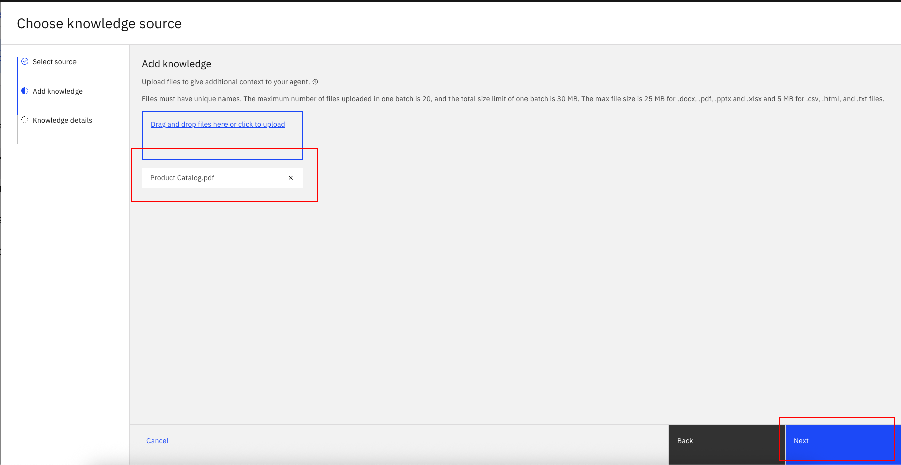


10. Fill the name as **product catalog** and description as shown below and click on **Save**:
```
This knowledge source is about late payment policy
```
   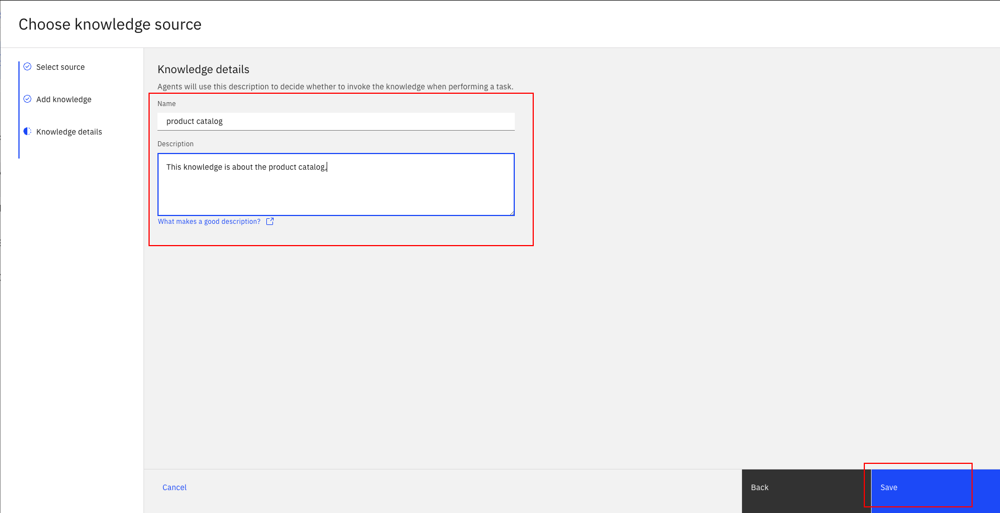


11. Wait until the file has been uploaded successfully and double check that it is now shown in the **Knowledge** section:
   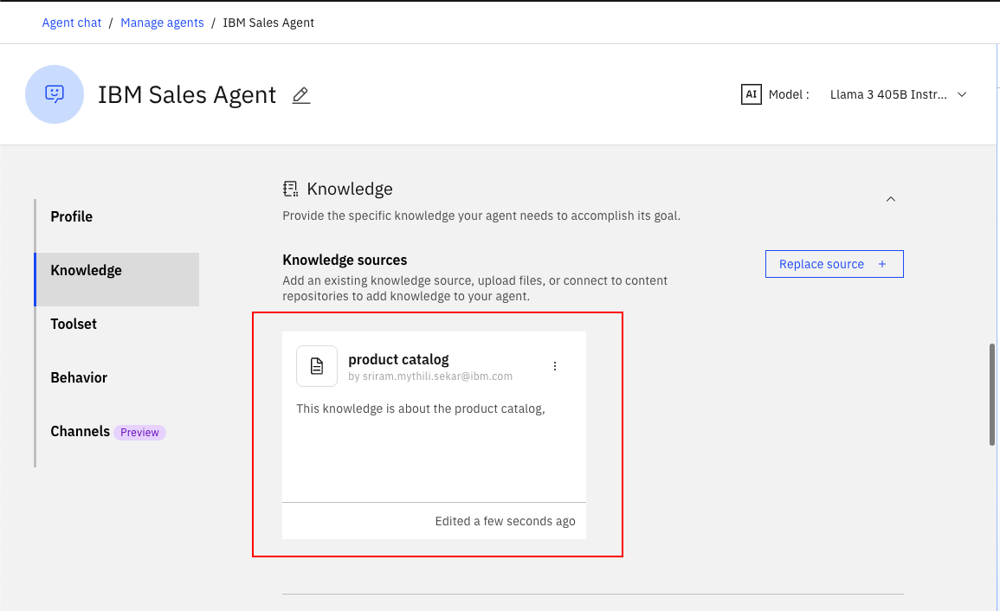


12. Scroll to the **Toolset** section. Click on **Add tool**:
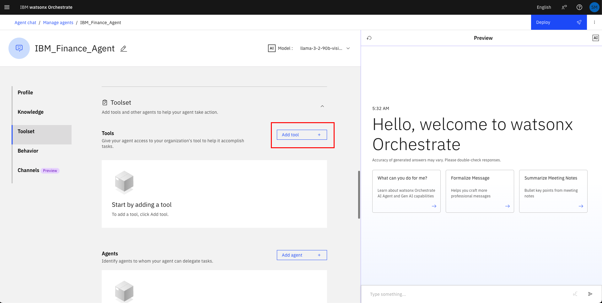


13. Click on the **Add from local instance**:
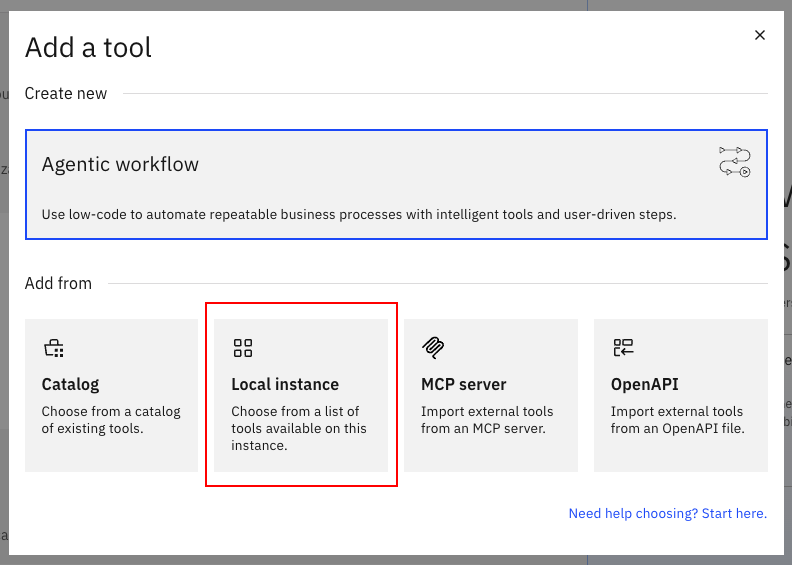


14. Search for "xero-mcp-server-workshop-bsp:list-items" and select the tool by checking the box:
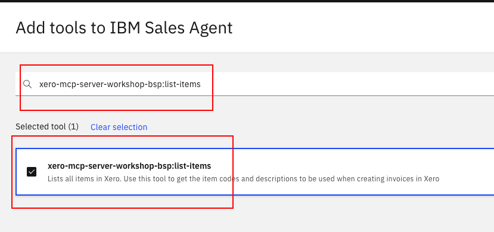


15. Search for "xero-mcp-server-workshop-bsp:list-contacts" and select the tool by checking the box:
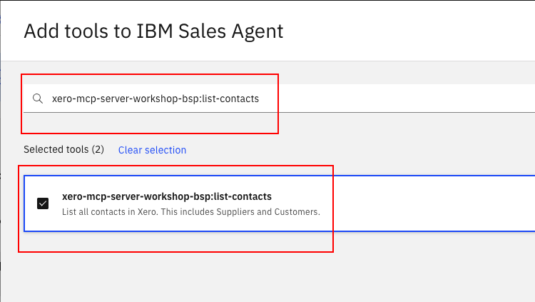


16. Search for "xero-mcp-server-workshop-bsp:list-tax-rates" and select the tool by checking the box:
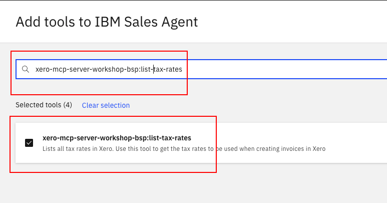


17. Search for "xero-mcp-server-workshop-bsp:create-quote" and select the tool by checking the box. Then click on **Add to agent**:
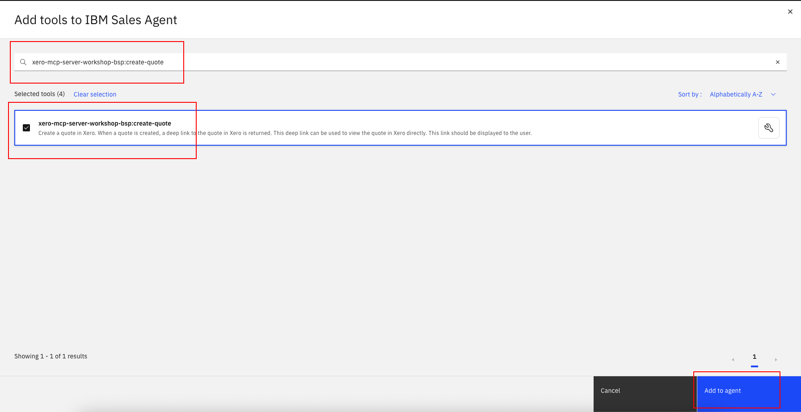


18. Wait until the tools has been added successfully and double check that it is now shown in the **Toolset** section:
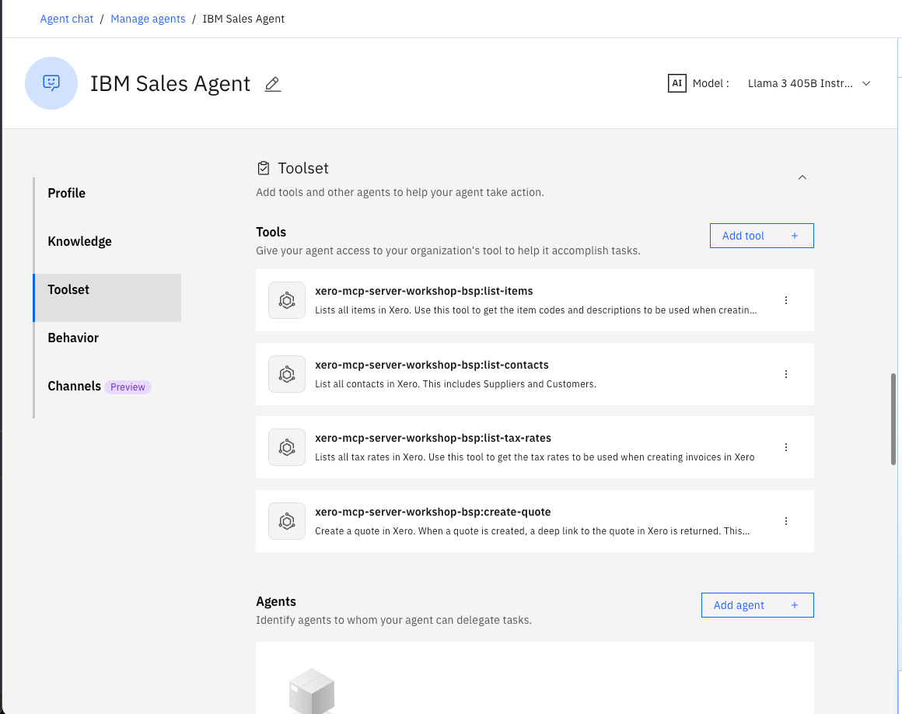


19. Scroll down to the **Behavior** section. Insert the instructions below into the **Instructions** field:

```
When the user asks for product warranty, fetch warranty details from the product catalog.
For specification comparisons, retrieve specs for both products from the catalog and present them side by side.
For extreme temperature requests, return only routers whose operating temperature ranges in the catalog meet the requested conditions.

When the user asks to generate a quote, follow this exact workflow:

Parse the user request and extract: product name or code, quantity, customer name, and any discount percentage mentioned.

Resolve the customer by calling list-contacts (start with page 1; if not found, move to the next page) and obtain the contactId.

Resolve the product by calling list-items (start with page 1; if not found, move to the next page) and obtain:
– Item name to use as description
– Sales price to use as the base price
– Sales account to use as accountCode (default to "200" if needed)

Determine the final unit price:
– If a discount is given, compute finalPrice = salesPrice × (1 − discount/100) and round to two decimal places.
– If no discount is given, finalPrice = salesPrice.

Call create-quote once you have all values, using this structure as the template and only changing the values:

{
  "contactId": "CONTACT_ID_HERE",
  "lineItems": [
    {
      "description": "PRODUCT_NAME_HERE",
      "quantity": 4,
      "unitAmount": 557.07,
      "accountCode": "200",
      "taxType": "OUTPUT2"
    }
  ]
}

Rules for the create-quote call:
– contactId is a string and appears as the first field.
– lineItems is an array of objects, never a string, never wrapped in extra quotes.
– Use standard JSON with double quotes, not single quotes.
– Each line item object includes exactly: description, quantity, unitAmount, accountCode, taxType.
– Do not send discountRate, reference, title, summary, terms, or quoteNumber.
– quantity and unitAmount must be numbers (for example 4 and 557.07, not "4" or "557.07").

If create-quote returns an error about missing or invalid fields, inspect the error, fill in the missing values using list-contacts, list-items, list-tax-rates, or the catalog where possible, and then retry create-quote. Only ask the user for a value if it cannot be obtained from any tool.

When asked about quotes for a customer in the past 30 days, first get the customer ID using list-contacts, then retrieve all quotes for that customer within the last 30 days, and return them in a formatted list with IDs, dates, statuses, totals, and view links.
```

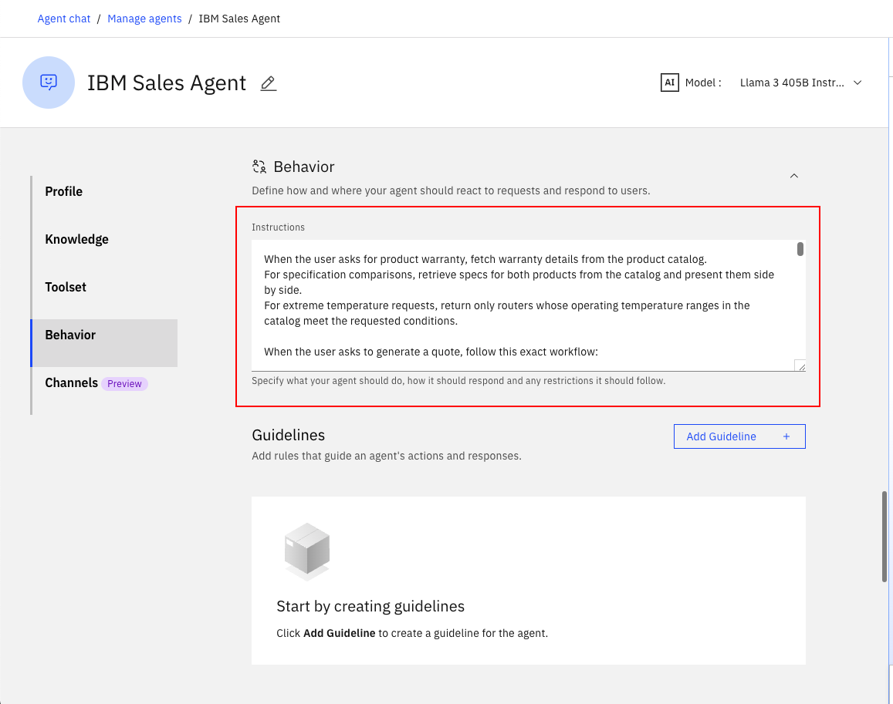


20. Test your agent in the preview chat on the right side by asking the following questions and validating the responses. They should look similar to what is shown in the screenshot(s) below:

```
What's the warranty on NR3000?
```


```
Which has higher switching capacity: AX9000 or SX500?
```


```
Which router works in extreme temperatures?
```


```
Generate a quote for 20 NR3000 routers for SMART Agency with a 10% discount.
```


